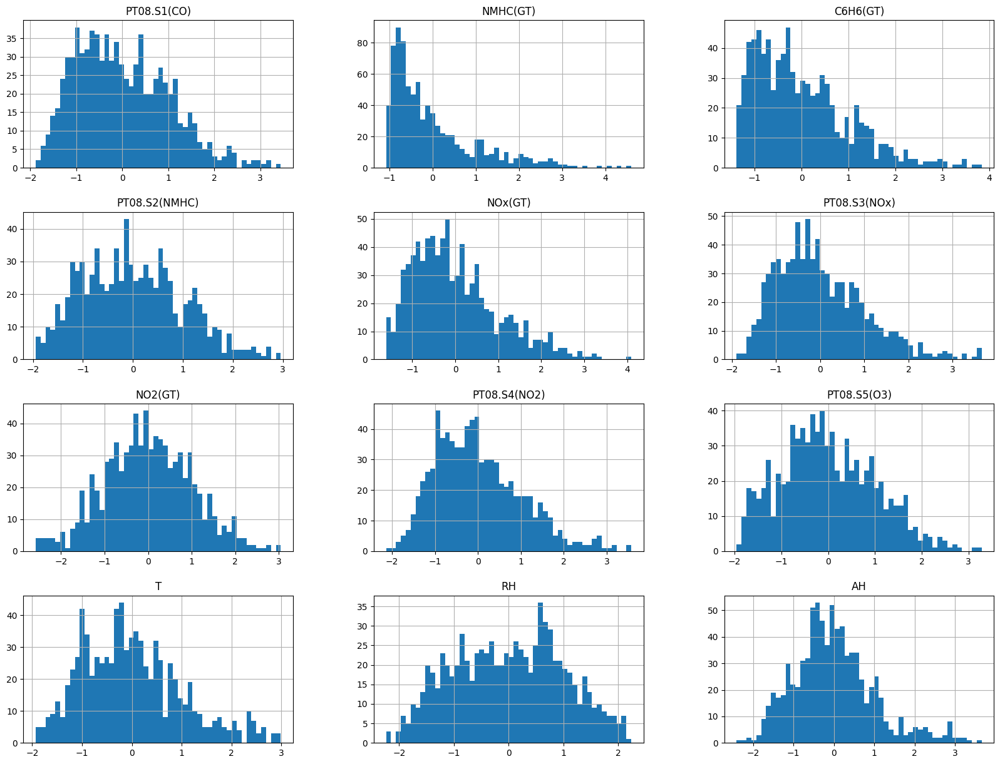

# Air Quality Prediction

This project aims to predict air quality based on pollutant levels and environmental factors using a deep learning model. The dataset used for this project is the Air Quality UCI dataset, which contains various air pollutant measurements and meteorological data.

## Dataset
The dataset used in this project is the Air Quality UCI dataset. It can be downloaded from the [UCI Machine Learning Repository](https://archive.ics.uci.edu/ml/machine-learning-databases/00360/AirQualityUCI.zip).

### Features
- **Date**: The date of data collection.
- **Time**: The time of data collection.
- **CO(GT)**: Concentration of carbon monoxide in mg/m^3.
- **PT08.S1(CO)**: Tin oxide sensor (temperature corrected) response for CO.
- **NMHC(GT)**: Non-methane hydrocarbons concentration in microg/m^3.
- **C6H6(GT)**: Concentration of Benzene in microg/m^3.
- **PT08.S2(NMHC)**: Titanium oxide sensor (temperature corrected) response for NMHC.
- **NOx(GT)**: Concentration of Nitric oxides in ppb.
- **PT08.S3(NOx)**: Tungsten oxide sensor (temperature corrected) response for NOx.
- **NO2(GT)**: Concentration of Nitrogen dioxide in microg/m^3.
- **PT08.S4(NO2)**: Tungsten oxide sensor (temperature corrected) response for NO2.
- **PT08.S5(O3)**: Indium oxide sensor (temperature corrected) response for O3.
- **T**: Temperature in °C.
- **RH**: Relative Humidity in %.
- **AH**: Absolute Humidity in g/m^3.

## Requirements
- Python 3.6+
- pandas
- numpy
- matplotlib
- seaborn
- scikit-learn
- tensorflow

## Exploratory Data Analysis
The project starts with an exploratory data analysis (EDA) to understand the distribution and relationships between different features. Key steps include:
- Loading and cleaning the data.
- Visualizing the distribution of sensor readings.
- Creating a correlation heatmap to identify relationships between features.

### Distribution of Sensor Readings

### Correlation Heatmap

## Model Building
The primary model used in this project is a neural network built using TensorFlow and Keras. The model architecture consists of:
- An input layer with 64 neurons and ReLU activation.
- A hidden layer with 32 neurons and ReLU activation.
- An output layer with a single neuron and linear activation.

## Model Evaluation
The model is evaluated using the following metrics:
- Mean Absolute Error (MAE)
- Root Mean Squared Error (RMSE)
- R-squared (R^2)

### Training History

### Predictions vs Actual Values

## Conclusion and Future Work
### Conclusion
- The deep learning model showed a reasonable performance in predicting the concentration of Nitrogen Dioxide (NO2(GT)).
- The Mean Absolute Error (MAE) indicates the average magnitude of errors in the predictions.
- The Root Mean Squared Error (RMSE) provides a measure of the differences between predicted and actual values.
- The R^2 score indicates the proportion of variance in the dependent variable predictable from the independent variables.

### Future Work
- Incorporate more advanced models such as XGBoost or LightGBM.
- Collect more data to improve the robustness of the models.
- Apply the model to real-time data for continuous air quality monitoring.
- Explore feature engineering techniques to create new informative features.
- Conduct hyperparameter tuning to further optimize the model performance.
